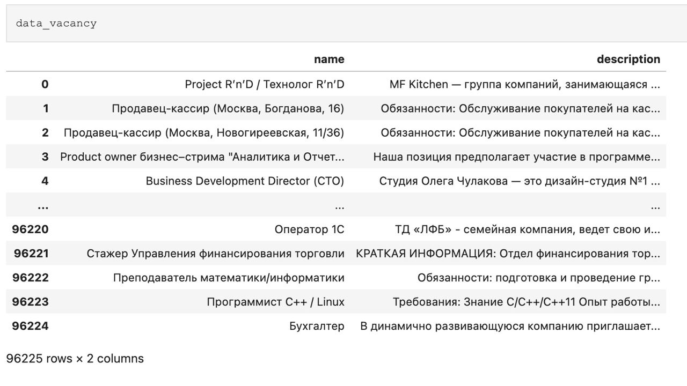

# Мэтчинг: резюме - вакансия

Данный проект выполнен в рамках курса "Глубокое обучение на практике" от магистратуры ITMO AI Talent Hub.

## Основная идея

Загружаем резюме через веб-сервис, получаем описание, информацию об основных навыках и опыте работы. Этот текст отправляем в заранее обученную модель. На выходе модели получаем summary, то есть наименование профессии. Это summary передаем через API на сайты поиска работы (hh.ru или trudvsem.ru) и ищем вакансии по нашему запросу.

## Описание используемых данных

За основу был взят [датасет вакансий](https://drive.google.com/file/d/1ikA_Ht45fXD2w5dWZ9sGTSRl-UNeCVub/view) с "hh.ru". Датасет представляет из себя таблицу:

Подробное EDA данного датасета с одноименным названием находится в отдельной ветке репозитория.

## Эксперименты

rut5-base absum, ...

## Inference 

[Модель](https://huggingface.co/basil-77/rut5-base-absum-vacancieshh) лежит на Hugging Face 

## MVP

Продукт представляет собой веб-сервис.

Веб-приложение позволяет загрузить своё резюме в формате PDF и получить на выходе подборку вакансий.

- Веб-приложение: streamlit
- Модель: rut5-base absum

